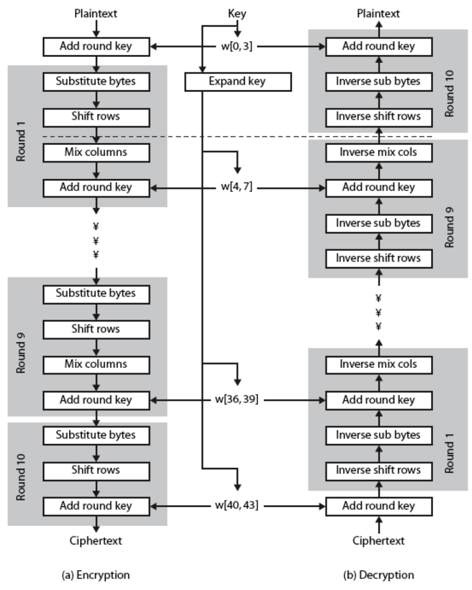

<style>
img {
	width: 70%;
}
</style>
# Cryptography

## Lecture 1 - Overview

### Computer Security


- 기밀성 : Authorized된 사용자에게만 접근을 보장하는 것
- 무결성 : Authorized된 사용자가 Authorized 된 방법으로만 변경가능한 것 (완전성 & 정확성)
- 가용성 : 적절한 시간에 Authorized된 당사자에게 접근가능해야 하는 것

### Aspects of Security

- 3 aspects of information security
	- security attack
	- security mechanism
	- security service

- Terms
	- threat : a potential for violation of security
	- attack : an assault on system security, a deliberate attempt to evade security services

### Passive / Active Attacks

- Passive Attacks
message의 contents를 엿보기만 함.
traffic analysis
- Active Attacks
masquerade
replay(auth)

### Security Services (X.800)

- Authentication : 상대편에 대한 인증을 제공하는 것
- Access Control : 통신링크를 통한 호스트 시스템과 응용 시스템간의 접근을 제한하고 통제하는 것
- Data Confidentiality : Authorized된 사용자에게만 접근을 보장하는 것
- Data Integrity : Authorized된 사용자가 Authorized 된 방법으로만 변경가능한 것 (완전성 & 정확성)
- Non-Repudiation : 부인불가, 부인봉쇄 -> 송수신자가 송수신 사실을 부인 못하게 막는 것
- Availability : 적절한 시간에 Authorized된 당사자에게 접근가능해야 하는 것

## Lecture 2 - Classical Encryption Techniques

### Cryptography

- Type of encryption operations used
	- substitution (대체)
	- transposition (데이터를 섞는 것)
	- product (여러가지 방법 혼용)

- Number of keys used
	- single-key or secret
	- double-key or public (공인인증서)


- Way in which plaintext is processed
	
	- block
	- stream (bit) -> high speed network 

### Cryptanalysis

- 궁극적인 목표 : To recover key not just message
- General approaches : 
	- Cryptanalytic attack (mathematical)
	- Brute-force attack

### More Definitions

- Unconditional Security : No matter how much computer power or time is available, the cipher cannot be broken
	> ideal, onetime pad 
- Computational Security : Given limited computing resources (e.g. time), the cipher cannot be broken
	> practical, modern algorithms.. 계산적으로 안전하며 시간이 충분이 주어지면 깨진다.
	> 

### Caesar Cipher

$$
C = (P+3) mod 26
$$
$$
P = (C-3) mod 26
$$
$$
C = E(K, P) = (P+K) mod 26
$$
$$
P = E(K, C) = (C-K) mod 26
$$

### Cryptanalysis of Caesar Cipher

- Only have 26 possible ciphers
- Could simply **try each** in turn (brute force search)

### Monoalphabetic Cipher

- Each plaintext letter maps to a diffrent **random** ciphertext letter

	$26! = 4 \times 10^{26}$ different mapping!
	> Safe? Not really because of 'Language Redundancy'
	> 
- Language Redundancy로 인해서 유추가 가능하므로 안전하지 않다.

### Polyalphabetic Cipher

- 글자마다 다른 테이블을 사용한다.
- $26\times26\times26=17526$ substitution cipher
- World War 2 때 사용되었다.
- Flatters frequency distribution
- 반복적 Table 사용으로 위험성은 여전히 존재한다.

### Transposition Cipher

- 글자를 섞는다.
- Rearranging -> but same language frequency
- Row Transposition Cipher

### Steganography

- 픽셀의 가장 마지막 값을 바꿔서 메시지를 숨긴다.
- ex) 저작권, 워터마크
- but, overhead가 크다.

### Product Ciphers
*a substitution followed by a transposition makes a new much harder cipher*

## Lecture 3 - Finite Fields

### Greatest Common Divisor

$GCD(A,B) = GCD(B, AmodB)$

### Modular Arithmetic

$-12mod7=2$
$2mod7=2$
$(2+7)mod7=2$
$(2+14)mod7=2$

### Modular Arithmetic Operations

$17^{14}mod8$
- Modular 연산은 피연산자에 미리 적용가능!
- $(17mod8)^{14}=1$

$9mod8=1$
$9^{2}mod8=1$
$9^{3}mod8=1$

### Group

A1) If $a,b\in G$, then $a\circ b\in G$
A2) $(a\circ b) \circ c = a \circ (b \circ c)$
A3) $a \circ e = e \circ a = a$
A4) $a \circ a^{-1} = e$
> if commutative $a \circ b = b \circ a$, then abelian group
> 

### Additive Group $Z_n$

$Z_{11}=${0,1,2,3,4,5,6,7,8,9,10}

```
2+3 = 5
8+9 = 6

X+7 = 3 -> X = 7
X-9 = 6 -> X = 4
2-X = 8 -> X = 5
```

### Multiplicative Group $Z^{*}_n$

$Z^{*}_{11}=${0,1,2,3,4,5,6,7,8,9,10}

```
X/9 = 6 -> X = 10
7X = 3 -> X = 2
2/X = 8 -> X = 3
```

### Example: $X^4 + X + 1$

Is $x^4+x+1$ irreducible over GF(2)?


## Chapter 4 - Block Ciphers & DES

### Feistel Cipher

- S-Box (Substitution)
- P-Box (Permutation)

- Provide *confusion&diffusion* of message & key
	- diffusion : plaintext/ciphertext, S-box
		- 하나의 비트를 바꾸면 전체비트로 변화가 확산됨
	- confusion : ciphertext/key, P-box
	 	- 평문과 암호문 사이 관계를 알수 없어야 한다.


### Data Encryption Standard (DES)

- 1977
- 64bit data, 56bit key
- Feistel Architecture
- most widely used
- not safe anymore
- 3DES


### Avalanche Effect

- A change of one input or key bit results in changing approx **half** output bits

## Chapter 5 - Advanced Encryption Standard

### Origins

- A replacement for DES was needed
- 3DES was slow, small
- Rijndael was selected as the AES in Oct-2000

### AES Cipher

- 128/192/256 bit keys, 128 bit data
- An iterative rather than Feistel Cipher
- Speed, Compact, Simple

### AES Structure

- byte substitution (S-Box)
- shift rows (Perm)
- mix-colums (S-Box)
- add round key (XOR)



### AES Key Expansion

`g(W) = S-Box(LRotWord(W)) XOR Rconi`

### AES Decryption

- Works since result is unchanged when
	- swap byte substitution & shift rows
	- mix columns & add round key
	- M(P+K) = MP + MK
	- "add-mix" = "mix-add"


